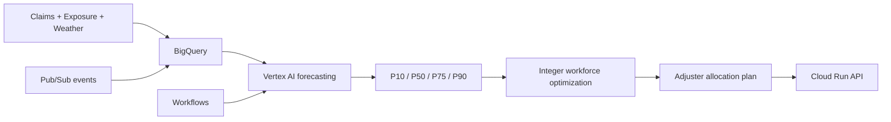

# Insurance Claims Forecasting & Adjuster Workforce Optimization

A P&C insurer must anticipate where property claims will arrive and position limited claims-adjuster
capacity before service levels deteriorate. This platform combines probabilistic claims forecasting
with constrained workforce optimization to produce actionable staffing plans under uncertainty.



## What it does

The executable local pipeline generates five years of weekly market data for FL, TX, CA, MD, VA, GA,
NC, NJ, NY and PA; models count demand without future-weather leakage; creates conformal forecast
quantiles; reconciles state forecasts to regions and the nation; and solves discrete staffing,
overtime, shortage, capacity and backlog decisions. A Florida hurricane scenario widens uncertainty
and triggers reallocation. All claims, exposure, workforce and cost assumptions are synthetic.

The analytical grain is market × week. The target is new claims reported, with supported planning
horizons of one through eight weeks. Workload converts claim counts using catastrophe-sensitive effort.
The decision pipeline is explicitly: **forecast → uncertainty → optimization → realized-cost backtest**.

## Quick start

Python 3.11+ is required. GCP credentials are not.

```bash
python -m venv .venv
.venv/Scripts/python -m pip install -e ".[dev]"   # Windows
.venv/Scripts/python scripts/run_demo.py
.venv/Scripts/python -m pytest -q
.venv/Scripts/python -m uvicorn insurance_claims_platform.serving.app:app --port 8080
```

Unix users can run `make setup`, then `make data`, `make demo`, `make test`, or `make serve`.
The demo prints metrics and decisions calculated during execution; this README intentionally contains
no fabricated benchmark results.

## Forecasting methodology

The baselines are last observation, four-week moving average and 52-week seasonal naive. The global
model is histogram gradient boosting with Poisson loss, market encoding, exposure, calendar features,
lags and rolling summaries. A chronological calibration tail converts residuals into P10/P50/P75/P90.
Rolling-origin splits preserve time order and metrics include MAE, RMSE, WAPE, sMAPE, MASE, bias,
underforecast rate, pinball loss, coverage and interval width. Results can be sliced by horizon, market,
size and catastrophe flag. Global learning can stabilize smaller markets; independent local modeling
is deliberately left as a documented extension until it earns its added variance and maintenance cost.

All target lags and rolling windows are shifted. Calendar and planned exposure are known at prediction
time. Weather outlooks are forecasted exogenous inputs. Realized precipitation, wind, event severity
and catastrophe labels are unknown future variables and cannot enter historical forecasts. Because
archived weather forecasts are not bundled, the demo uses lagged weather as a noisy outlook proxy.
Bottom-up state aggregation provides exact regional and national coherence.

## Optimization formulation

For market \(m\), \(x_m\) is integer assigned adjusters; \(o_m\), \(s_m\), and \(e_m\) are overtime,
uncovered workload/closing backlog, and excess capacity. At selected quantile \(q\):

\[
\min \sum_m c_x x_m + c_o o_m + (c_s+c_b)s_m + c_e e_m + c_t t_m^+
\]

subject to

\[
kx_m + k_o o_m + s_m-e_m = D_m(q)+B_m, \quad
\sum_m x_m=\sum_m x_m^{current}, \quad x_m\in\mathbb{Z}_{\ge0}
\]

plus market minimum/maximum staffing, reassignment bounds and overtime limits. SciPy MILP with HiGHS
solves the actual model; transfer costs are applied to staff moved in. P50, P75 and P90 plans quantify
the trade-off between cost, overtime and shortage risk. See [the full formulation](docs/optimization/formulation.md).

## API

- `GET /health`
- `POST /v1/forecast` — markets, 1–8 week horizon, quantiles
- `POST /v1/optimize` — forecast ID, planning quantile, overtime/reassignment switches
- `POST /v1/scenarios` — demand and catastrophe multipliers
- `GET /v1/forecasts/{forecast_id}` and `GET /v1/plans/{plan_id}`

Requests are Pydantic-validated, carry request IDs, structured errors and model metadata. The local
in-memory stores are replaced by BigQuery repositories in deployment. Event publisher interfaces have
idempotent filesystem and real Pub/Sub implementations.

## Data and catastrophe scope

The simulator uses a Gamma–Poisson mixture driven by exposure, trend, annual seasonality, regional
vulnerability, precipitation, wind and sparse storm severity. It produces realistic overdispersion,
catastrophe-sensitive workload, completed claims and opening/closing backlog. It is not a catastrophe
risk or insured-loss model. Selected NOAA/FEMA sources, provenance, usage terms and limitations are in
[data_sources.md](docs/data_sources.md).

## GCP production architecture and MLOps

BigQuery tables are date-partitioned by target/observation week and clustered by market. Pub/Sub
continuously ingests claim, status and availability events; weekly forecasting and retraining remain
scheduled batch work. Workflows coordinates refresh → Vertex AI pipeline → quality gate → forecasts →
optimizer → persisted plan. Vertex AI provides managed training, experiments and Registry; Cloud Run
serves a stateless container. Monitoring covers forecast error/bias/coverage/drift and API latency,
failures, solve time, feasibility, backlog, utilization, overtime, service and realized-vs-expected cost.

A challenger is promoted only if WAPE, bias, P90 calibration and decision-backtest cost meet configured
champion gates. PSI/KS/Wasserstein alerts alone do not trigger retraining. Details are in the
[architecture note](docs/architecture/overview.md) and [ADR](docs/decisions/0001-core-decisions.md).

## Deployment and Terraform

Authenticate with `gcloud auth application-default login`, create an Artifact Registry repository,
build/push the Docker image, then:

```bash
cd infrastructure/terraform
cp terraform.tfvars.example terraform.tfvars
terraform init
terraform fmt -check
terraform validate
terraform plan
terraform apply
```

Project IDs and image names are variables; credentials are never stored. Terraform provisions required
APIs, a BigQuery dataset, Pub/Sub topic, least-privilege API service account and Cloud Run. Production
adds private egress, Secret Manager, CMEK where policy requires it, Workflows/Vertex pipeline templates,
retention controls and authenticated ingress. Tear down development resources with `terraform destroy`;
the BigQuery dataset intentionally refuses content deletion by default.

Cloud Run, BigQuery storage/queries, Pub/Sub, Artifact Registry and Vertex jobs incur cost. Keep Cloud
Run maximum instances low, use BigQuery partition filters, lifecycle old artifacts, and run small
CPU Vertex jobs only on schedule. No cloud resource is needed locally.

## Engineering, security and responsible use

The `src/` package separates simulation, features, forecasting, hierarchy, optimization, scenarios,
backtesting, monitoring, cloud adapters and serving. CI checks Ruff, mypy, pytest, Docker build and
Terraform format/validation without GCP credentials. No policyholder-level PII is generated; inputs are
validated and secrets belong in Secret Manager. IAM grants only BigQuery job/data roles to the API.

These recommendations are decision support. Regional fairness, catastrophe safety, labor rules,
specialized skills and local operational knowledge require human review. See
[responsible ML](docs/responsible_ml/claims_operations.md).

## Scale and limitations

National scale uses partitioned/clustered BigQuery facts, Pub/Sub subscriptions with dead-letter topics,
distributed Vertex jobs and regional optimization decomposition by skill before a national balancing
pass. Products and skill classes become explicit dimensions. Forecast refresh remains weekly while
events remain real-time.

The local implementation is intentionally not carrier scale. Its weather is synthetic; quantiles use
pooled residual calibration rather than market/horizon-specific conformal scores; transfers are net
market movements rather than employee routes; catastrophe skills, travel matrices and budget caps are
design extensions; no production GCP deployment has been made by this repository. SHAP, MinT and a
statistical ETS comparator should be added only with validated incremental value. Public-source terms
must be rechecked before production ingestion.

